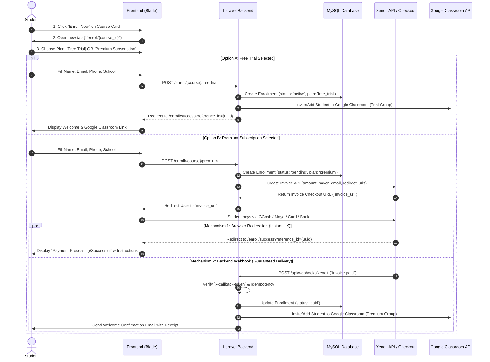

# Xendit Payment & Google Classroom Enrollment Integration Plan

This document outlines the complete architectural design and workflow for integrating **Xendit Payments** and **Google Classroom** enrollment into the **SG-Review** Laravel platform.

---

## 1. Flow Verification & Architectural Explanation

### Did you have the correct flow?
**Yes! Your understanding is 90% correct, but there is one critical architectural distinction you need to know for production payment processing.**

When a student pays via Xendit:
1. **Frontend Redirection (`success_redirect_url`)**: Once the student successfully pays on the Xendit checkout screen, Xendit redirects their browser to your designated success page (e.g., `/enroll/payment-success`). This provides **instant visual confirmation** to the user.
2. **Backend Webhook Callback (The Missing 10%)**: You **cannot solely rely on the browser redirection** to mark the student as paid or enroll them in Google Classroom. Why?
   - If the student closes their browser tab immediately after paying (before the redirect completes), or if their internet drops during the redirect, they will never reach the success page!
   - A malicious user could also try to visit `/enroll/payment-success` manually without paying.

### The Best Practice 2-Tier Verification Flow
To ensure 100% reliability and security, we implement a **Dual-Mechanism Flow**:
- **Mechanism A (User Experience - Redirection)**: When Xendit creates an invoice, we provide a `success_redirect_url` pointing to our frontend success page (`/enroll/success?reference_id={UUID}`).
- **Mechanism B (System Reliability - Webhook/Callback)**: Xendit's servers asynchronously send a secure HTTP `POST` request (`invoice.paid` callback) directly to our backend route (`/api/webhooks/xendit`). Our server verifies the `x-callback-token`, updates the enrollment status in the database to `paid`, and triggers the **Google Classroom invitation/enrollment**.

---

## 2. End-to-End Workflow Diagram



---

## 3. Database Schema Design

We need a dedicated `enrollments` table to track both Free Trial and Premium students cleanly, alongside exact Xendit transaction records.

### Migration: `create_enrollments_table.php`
```php
Schema::create('enrollments', function (Blueprint $table) {
    $table->id();
    $table->uuid('reference_id')->unique(); // External ID sent to Xendit
    $table->foreignId('course_id')->constrained()->onDelete('cascade');
    
    // Student Information
    $table->string('student_name');
    $table->string('student_email');
    $table->string('student_phone');
    $table->string('school_branch')->nullable();
    
    // Plan & Status
    $table->enum('plan_type', ['free_trial', 'premium'])->default('free_trial');
    $table->enum('status', ['pending', 'paid', 'active', 'expired', 'failed', 'cancelled'])->default('pending');
    $table->decimal('amount', 10, 2)->default(0.00);
    
    // Xendit Metadata
    $table->string('xendit_invoice_id')->nullable();
    $table->string('xendit_invoice_url')->nullable();
    $table->string('payment_channel')->nullable(); // e.g., GCASH, PAYMAYA, CREDIT_CARD
    $table->timestamp('paid_at')->nullable();
    
    // Google Classroom Metadata
    $table->boolean('google_classroom_enrolled')->default(false);
    $table->string('google_classroom_invite_id')->nullable();
    $table->timestamp('trial_expires_at')->nullable();
    
    $table->timestamps();
});
```

---

## 4. Laravel Architecture & Component Breakdown

Following Senior Laravel guidelines (`clean architecture, thin controllers, service layer, form requests`), here is how the code will be structured:

### A. Route Definitions (`routes/web.php` & `routes/api.php`)

```php
// routes/web.php - Student Facing Routes
Route::prefix('enroll')->group(function () {
    // Selection & Checkout Page
    Route::get('/{course}', [EnrollmentController::class, 'showSelection'])->name('enroll.selection');
    
    // Form Submission Handlers
    Route::post('/{course}/free-trial', [EnrollmentController::class, 'storeFreeTrial'])->name('enroll.free');
    Route::post('/{course}/premium', [EnrollmentController::class, 'storePremium'])->name('enroll.premium');
    
    // Success & Status Page
    Route::get('/status/success', [EnrollmentController::class, 'success'])->name('enroll.success');
});

// routes/api.php - Xendit Webhook (Excluded from CSRF)
Route::post('/webhooks/xendit', [WebhookController::class, 'handleXenditInvoice'])->name('webhooks.xendit');
```

### B. Service Layer (`app/Services/`)

1. **`XenditPaymentService.php`**
   - **`createInvoice(Enrollment $enrollment, Course $course): array`**:
     Uses Xendit PHP SDK or clean `Http::withHeaders()->post()` to create a Xendit Invoice.
     ```php
     $response = Http::withBasicAuth(config('services.xendit.secret_key'), '')
         ->post('https://api.xendit.co/v2/invoices', [
             'external_id' => $enrollment->reference_id,
             'amount' => (float) $course->price,
             'payer_email' => $enrollment->student_email,
             'description' => "Enrollment for {$course->title} ({$enrollment->plan_type})",
             'success_redirect_url' => route('enroll.success', ['reference_id' => $enrollment->reference_id]),
             'failure_redirect_url' => route('enroll.selection', ['course' => $course->id, 'error' => 'payment_failed']),
             'currency' => 'PHP',
         ]);
     ```
2. **`GoogleClassroomService.php`**
   - **`enrollStudent(Enrollment $enrollment): bool`**:
     Calls Google Classroom API (`Google_Service_Classroom`) to invite/add the student's email to the respective Classroom course ID or generates the direct invite link.

### C. Controllers (`app/Http/Controllers/`)

1. **`EnrollmentController.php`** (Thin Controller)
   - `showSelection(Course $course)`: Renders the Free Trial vs. Premium selection page.
   - `storeFreeTrial(EnrollFreeTrialRequest $request, Course $course)`: Validates input, creates DB record (`active`), triggers `GoogleClassroomService`, and redirects to `enroll.success`.
   - `storePremium(EnrollPremiumRequest $request, Course $course)`: Validates input, creates DB record (`pending`), calls `XenditPaymentService::createInvoice()`, saves `xendit_invoice_url`, and redirects (`Redirect::to($invoice['invoice_url'])`).
   - `success(Request $request)`: Displays the success confirmation and verifies database status.

2. **`WebhookController.php`** (Security & Idempotency)
   - `handleXenditInvoice(Request $request)`:
     ```php
     // 1. Verify Xendit Callback Token
     if ($request->header('x-callback-token') !== config('services.xendit.callback_token')) {
         return response()->json(['error' => 'Unauthorized signature'], 401);
     }

     // 2. Extract Data & Idempotency Check
     $externalId = $request->input('external_id');
     $status = $request->input('status'); // 'PAID' or 'EXPIRED'
     
     $enrollment = Enrollment::where('reference_id', $externalId)->firstOrFail();
     
     if ($enrollment->status === 'paid') {
         return response()->json(['message' => 'Already processed']); // Idempotent response
     }

     if ($status === 'PAID') {
         $enrollment->update([
             'status' => 'paid',
             'paid_at' => now(),
             'payment_channel' => $request->input('payment_channel'),
         ]);

         // 3. Trigger Google Classroom & Notification
         app(GoogleClassroomService::class)->enrollStudent($enrollment);
     }

     return response()->json(['status' => 'success']);
     ```

---

## 5. Frontend & UI Design Specs

### 1. Updating `courses.blade.php` ("Enroll Now" Button)
Modify the current "Enroll Now" button (`target="_blank"`) to point to our internal selection & checkout page instead of an external link:
```blade
<a href="{{ route('enroll.selection', ['course' => $course->id]) }}" target="_blank" rel="noopener noreferrer"
   class="px-6 py-2.5 rounded-full font-bold bg-blue-600 text-white hover:bg-blue-700 shadow-md shadow-blue-600/20 transition-all hover:-translate-y-0.5">
    Enroll Now
</a>
```

### 2. Keeping `enrollment_link` as a Backup Google Form & Adding `google_classroom_id`
From a high-availability and business continuity perspective, keeping `enrollment_link` as an **External / Backup Google Form Link** alongside `google_classroom_id` is best practice! If payment gateways (like Xendit, GCash API, or banking systems) or the local server undergo maintenance, students can still manually enroll via the backup Google Form link (`enrollment_link`) displayed on a fallback button.

- **Database Migration (`courses` table)**:
  Keep `enrollment_link` (make nullable or require as fallback URL) and **add `google_classroom_id`** (`$table->string('google_classroom_id')->nullable();`).
- **Admin Views (`reviewers/create.blade.php` & `reviewers/edit.blade.php`)**:
  Include BOTH fields inside the admin creation/edit form so admins can configure both:
  ```blade
  <div class="grid md:grid-cols-2 gap-6 border-t border-slate-100 pt-6">
      <div class="space-y-2">
          <label for="enrollment_link" class="block text-sm font-bold text-slate-700">Backup Enrollment Link (Google Form) <span class="text-red-500">*</span></label>
          <input type="url" id="enrollment_link" name="enrollment_link" required value="{{ old('enrollment_link', $course->enrollment_link ?? '') }}" placeholder="https://forms.gle/..." class="w-full px-4 py-2.5 rounded-lg border border-slate-300 focus:ring-2 focus:ring-blue-500 focus:border-blue-500 outline-none transition-all">
          <p class="text-xs text-slate-500">Used as fallback if payment gateways or server are under maintenance.</p>
      </div>

      <div class="space-y-2">
          <label for="google_classroom_id" class="block text-sm font-bold text-slate-700">Google Classroom ID / Invite Link <span class="text-red-500">*</span></label>
          <input type="text" id="google_classroom_id" name="google_classroom_id" required value="{{ old('google_classroom_id', $course->google_classroom_id ?? '') }}" placeholder="e.g., 1234567890 or https://classroom.google.com/c/..." class="w-full px-4 py-2.5 rounded-lg border border-slate-300 focus:ring-2 focus:ring-blue-500 focus:border-blue-500 outline-none transition-all">
          <p class="text-xs text-slate-500">Used for automatic enrollment when Xendit payment/trial succeeds.</p>
      </div>
  </div>
  ```
- **`Course.php` Model & `ReviewerController.php`**:
  Add `google_classroom_id` to `$fillable` array in `Course.php` alongside `enrollment_link`. Update controller validation rules to include both (`'enrollment_link' => 'required|url'`, `'google_classroom_id' => 'required|string|max:255'`).

### 3. New Page: `resources/views/pages/enrollment/select.blade.php`
A premium, glassmorphism dual-card layout comparing **Free Trial** vs. **Premium Reviewer Access**:
- **Left Card (Free Trial)**:
  - Badge: "7-Day Trial" / "Module 1 Access"
  - Price: **₱0**
  - Features checklist: Basic Module Access, Sample Quizzes, Community Support.
  - Form fields: Name, Email, Phone, School/Branch.
  - Button: `"Start Free Trial Now"` (Submits to `/enroll/{course}/free-trial`).
- **Right Card (Premium Access - Recommended)**:
  - Badge: "Full Reviewer & Lifetime/Season Access"
  - Price: **₱{Course Price}** (One-time or Subscription)
  - Features checklist: All Modules & Lessons, Mock Board Exams, Live Zoom Q&A, Direct Google Classroom Access, Downloadable Handouts.
  - Form fields: Name, Email, Phone, School/Branch.
  - Payment badges icon bar: GCash, Maya, Visa/Mastercard, 7-Eleven, QR Ph.
  - Button: `"Proceed to Secure Payment"` (Submits to `/enroll/{course}/premium`).
- **Fallback / System Maintenance Banner**:
  - At the bottom of the page, include a helpful fallback link: `"Experiencing online payment issues or system maintenance? Click here to enroll manually via our Google Form"` (`$course->enrollment_link`).

### 4. New Page: `resources/views/pages/enrollment/success.blade.php`
- Shows an animated checkmark (`🎉 Enrollment Confirmed!`).
- Displays the summary of what they enrolled in (`Plan: Free Trial` or `Plan: Premium Access`).
- Displays the **Google Classroom Invite Button (`Join Google Classroom Now`)** using `$course->google_classroom_id` or instructions on checking their email inbox.

---

## 6. Environment & Configuration Setup (`.env`)

Add the following keys to your `.env` and `config/services.php`:

```env
# Xendit Configuration
XENDIT_SECRET_KEY="xnd_development_..."
XENDIT_PUBLIC_KEY="xnd_public_development_..."
XENDIT_CALLBACK_TOKEN="your_xendit_webhook_verification_token"

# Google Classroom Configuration (Service Account / OAuth)
GOOGLE_CLASSROOM_CLIENT_ID="..."
GOOGLE_CLASSROOM_CLIENT_SECRET="..."
GOOGLE_CLASSROOM_REDIRECT_URI="${APP_URL}/auth/google/callback"
```

---

## 7. Implementation Checklist / Next Steps

- [ ] **Step 1: Database & Models (`Course` & `Enrollment`)**
  - Create the `enrollments` migration and `Enrollment` Eloquent model.
  - Create a migration to modify `courses` table: add `google_classroom_id` (string) alongside `enrollment_link`.
  - Update `$fillable` in `App\Models\Course.php` to include `google_classroom_id`.
- [ ] **Step 2: Admin Dashboard Refactoring (`create.blade.php`, `edit.blade.php` & `ReviewerController.php`)**
  - Keep `enrollment_link` (labeled as "Backup Enrollment Link") and add `google_classroom_id` field in [create.blade.php:L56-L59](file:///c:/Users/PC/Documents/segovia/SG-Review/resources/views/reviewers/create.blade.php#L56-L59) and [edit.blade.php:L60-L64](file:///c:/Users/PC/Documents/segovia/SG-Review/resources/views/reviewers/edit.blade.php#L60-L64).
  - Update `ReviewerController::store()` and `update()` validation rules to validate both (`'google_classroom_id' => 'required|string|max:255'`).
- [ ] **Step 3: Service Layer & Configuration**
  - Configure `config/services.php` for Xendit.
  - Create `XenditPaymentService` (`createInvoice`).
  - Create `GoogleClassroomService` (`enrollStudent` using `$course->google_classroom_id`).
- [ ] **Step 4: Student Controllers & Form Requests**
  - Create `EnrollFreeTrialRequest` and `EnrollPremiumRequest` validation classes.
  - Implement `EnrollmentController` (`showSelection`, `storeFreeTrial`, `storePremium`, `success`) and `WebhookController`.
- [ ] **Step 5: Student Blade Views & UI Polish**
  - Build `select.blade.php` (plan selection & form, plus backup Google Form link).
  - Build `success.blade.php` (confirmation & direct classroom access).
  - Update `courses.blade.php` "Enroll Now" button to route to `enroll.selection`.
- [ ] **Step 6: Local Testing & Webhook Simulation**
  - Test checkout flow using Xendit Test Mode e-wallets/cards (`09181234567` for GCash).
  - Use `ngrok` or Xendit Webhook simulator to verify local `POST /api/webhooks/xendit` callbacks.
